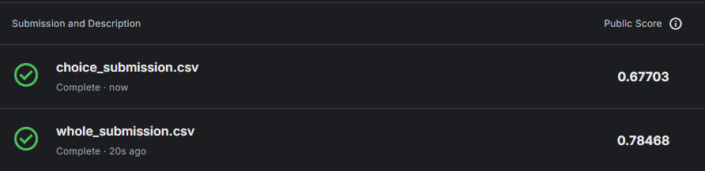

# 기계학습 및 실습 과제 - Titanic Data Analysis and Machine Learning Model Building

## nbviewer Link
https://nbviewer.org/github/kty2001/ML_project/blob/main/titanic_analysis.ipynb

### TODO 리스트
* [X] 데이터 다운
* [X] 필요 라이브러리 확인
* [X] 데이터 분석
* [X] 데이터 시각화
* [X] 머신러닝 진행
* [X] 오류 수정
* [X] 문서 작성
* [X] nbviewer 연결

### 데이터 다운
[Kaggle Titanic Dataset Link](https://www.kaggle.com/c/titanic/data)에서 데이터 다운로드
- train.csv(훈련 데이터 csv) 필수
- test.csv(예측 데이터 csv) 필수
- gender_submission.csv(Kaggle 제출 형식 csv) 선택
- 다운받은 모든 csv 파일을 data 디렉토리에 삽입

### 외부 라이브러리 설치
```bash
python -V # 3.10.12
pip install pandas==2.2.3
pip install jupyter==1.1.1
pip install seaborn==0.13.2
pip install scikit-learn==1.5.2
```

or

```bash
pip install -r requirements.txt
```

### 분석 목적
- 각 변수 간의 상관관계 파악
- Pclass와 Fare를 통하여 Survived를 예측

### 구체적 구현
- 데이터 확인
    - 데이터 변수 별 데이터 타입 및 결측치 확인
- 데이터 전처리
    - 문자열 데이터 처리
        - unique 값이 많은 Name 및 Ticket 열 제거
        - Sex 열 male = 0, female = 1 값을 가지도록 변환
        - Embarcked S = 0, C = 1, Q = 2, 결측치는 최빈값인 S(= 0)로 변환
    - 결측치 처리
        - Cabin 열 제거
        - Fare 결측치 평균값 사용
        - Age 열 방치
- 상관계수 확인
    - 피어슨 상관계수
    - 스피어만 상관계수
- 가설 설정
    - Pclass와 Fare로 Survived를 예측 가능함
- 관련 변수들 시각화
    - 단일 변수 시각화
        - Survived 비율
        - Pclass 비율
        - Fare 분포
    - 다중 변수 시각화
        - Pclass 별 Survived 수
        - Pclass와 Fare 산점도 및 박스플롯
- 머신러닝 훈련 및 예측
    - RandomForestClassifier 모델 사용
    - 파라미터 설정: n_estimators=100, max_depth=5, random_state=1, 나머지 default
    - 전처리한 변수 전체를 이용하여 훈련 및 예측
    - 전처리한 변수 중 Pclass와 Fare를 이용하여 훈련 및 예측

### 결과

- 전처리한 데이터의 변수 전체로 예측한 결과: 0.78468
- 전처리한 데이터의 변수 중 Pclass와 Fare로 예측한 결과: 0.67703

### 결론
Pclass와 Fare만으로 Survived를 예측하기에는 부족한 면이 있음